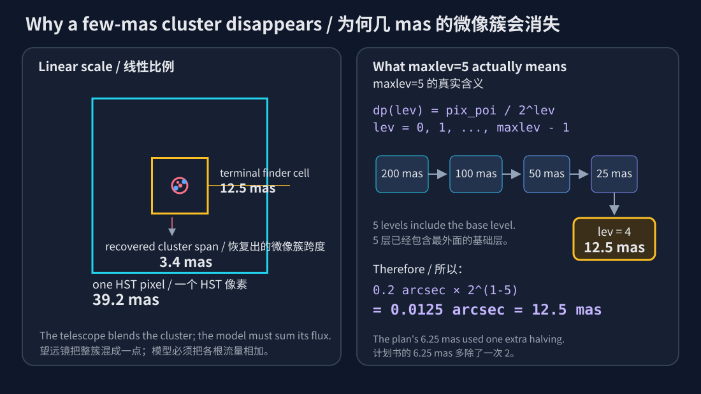
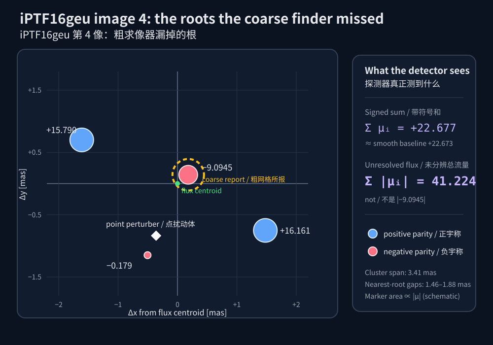
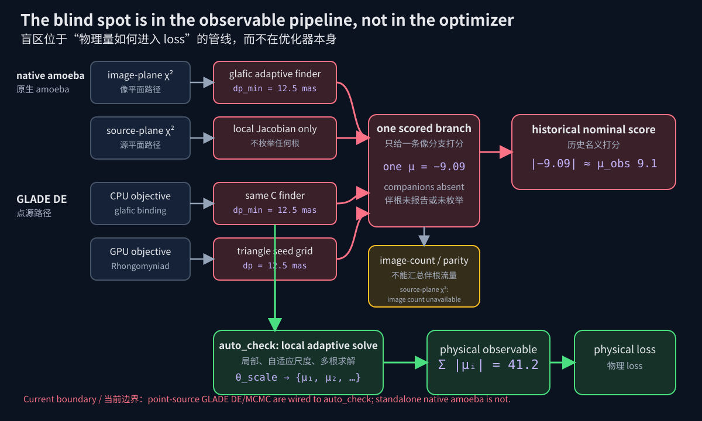
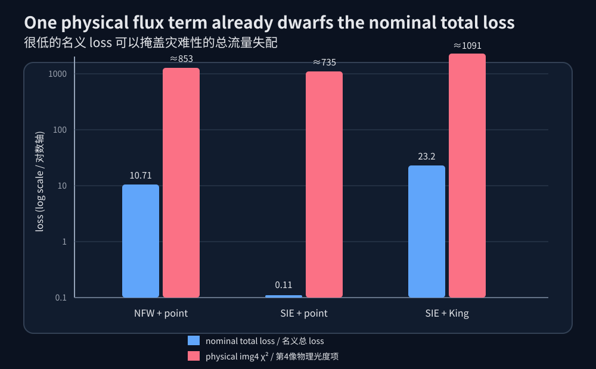

# GLADE / glafic 微像盲区调查报告
## 为什么一次“很精确”的求解，仍可能看不见同一观测像里的多个真实像

**日期**：2026-07-19

**对象读者**：大学物理专业新生；无需天文学背景。本文假定读者已经理解 amoeba 与差分进化（DE）的搜索过程，因此不重复介绍优化器。

**调查范围**：GLADE 点源 DE 的 CPU/GPU 路径、glafic 原生 amoeba 的像面/源面点源 χ²、历史 run、当前工作树中的 auto_check 实现，以及 [microimage_auto_check_plan.md](../microimage_auto_check_plan.md)。

**版本说明**：本文区分“已提交的 HEAD”与“当前未提交工作树”。前者仍有漏洞；后者已有 point-source auto_check 实现，但尚有明确边界，不能把它写成已发布且绝对完备的保证。

[English version / 英文版](Microimage_Blind_Spot_Investigation_en.md)

---

## 一页结论

**是的，amoeba 与 GLADE 的 DE 都有这一类问题。** 共同错误不在 amoeba 或 DE 如何搜索参数，而在它们最终相信的点源目标函数：

1. 粗求像器只找到一个微像根；
2. 匹配器把该根当作一个观测宏像；
3. 光度 loss 使用该根的 |μ|；
4. 但望远镜实际测到的是同一 PSF 内所有未分辨微像的总流量，模型量应为 Σ|μᵢ|。

二者也有重要差别：

| 路径 | 是否存在结构性风险 | 本调查的限定 |
|---|---:|---|
| GLADE DE，CPU 点源 | **有** | 已提交基线会用单根放大率；当前工作树的 auto_check 已接入 |
| GLADE DE，GPU 批量点源 | **有** | GPU 有独立求像器，但共享同一错误观测量；当前工作树已有独立局部检查 |
| glafic amoeba，像面 χ² | **有** | 直接调用同一个 glafic findimg；宇称与像数守卫只能挡住部分案例 |
| glafic amoeba，源面 χ² | **有** | 它不枚举像，而是在观测位置使用单支局部 Jacobian；调细网格也不能得到 Σ|μᵢ| |
| GLADE 扩展源 DE | **未被本修补覆盖** | 纯像素面亮度拟合不是同一个单点 μ 问题；若另带点源 flux constraint，仍需单独审计 |

本仓库历史案例给出了直接定罪证据：img4 的粗解为 μ≈−9.09，看似吻合观测 |μ|=9.1；细解却得到四个微像，

~~~text
+16.16067, −9.09454, +15.78977, −0.17922
Σ|μᵢ| = 41.22420
Σ μᵢ  = 22.67668
~~~

所以该像不是被压暗到 9.1，而是被分裂成一个总流量约 41.2 的未分辨微像簇。只算 img4 的放大率 χ² 就约为 852.86，远大于历史名义总 loss 10.71。

> 最简短的根因：**坐标可以精确到 10⁻¹⁰ arcsec，但前提是那个根已经得到一个 Newton 初始种子。网格从未给伴像播种时，再高的 Newton 精度也看不见它。**

---

## 1. 先把“一个像”分成三种含义

### 1.1 根、微像簇、观测像

点源的透镜方程是

~~~text
β = θ − α(θ)
~~~

β 是源在没有透镜时的角位置，θ 是望远镜天空平面上的像位置，α 是透镜偏转角。给定同一个 β，方程可能有多个 θ 解；每个数学解就是一个**像根**。

在平滑的星系尺度透镜中，几个根通常相隔几百毫角秒，望远镜能把它们当成不同“宏像”。若一个点质量或很致密的子结构恰好靠近某个宏像，它会在原宏像附近制造一条极小的临界曲线，把原根改造成几个相距从亚 mas 到约 11 mas 的**微像**；本案 point-mass 簇约为 3.4 mas。

因此本报告使用三层词义：

- **根（root）**：透镜方程的一个数值解；
- **微像簇（microimage cluster）**：同一宏像附近、由局部致密扰动产生的一组根；
- **观测像（observed image）**：望远镜的一团 PSF 光斑。若微像间距小于仪器分辨率，一个观测像可以包含多个根。

### 1.2 μ 的正负不是正负光子数

局部映射的 Jacobian 为 A=∂β/∂θ，带符号放大率为

~~~text
μ = 1 / det(A)
~~~

|μ| 是面积与总流量的放大倍数；μ 的符号表示**宇称**，也就是局部像是否发生镜像翻转：

- μ>0：正宇称，局部方向保持；
- μ<0：负宇称，局部方向翻转。

负号不是“负的光”。因此一个无法分辨的微像簇，其观测流量为

~~~text
Fobs = Fsource × Σ |μᵢ|
~~~

而不是 Fsource×|某一个 μ|，也不是 Fsource×|Σμᵢ|。带符号和 Σμᵢ 对检查透镜拓扑很有用，但探测器把到达的光子相加，实际光度使用 Σ|μᵢ|。这是子结构透镜与微透镜计算中的标准观测量；可参见 [Keeton 2003](https://arxiv.org/abs/astro-ph/0209040) 与 [Metcalf & Madau 2001](https://arxiv.org/abs/astro-ph/0108224)。

### 1.3 “未分辨”到底有多小

本项目所附 iPTF16geu 资料给出的 HST 像素尺度约为 39.2 mas；PSF 宽度还会大于一个像素。历史 point-mass 案例的四个微像最大跨度约 3.41 mas，只有一个 HST 像素宽度的约 8.7%。望远镜会把它们卷积成同一团光，无法逐根测量。

图中的三个尺度回答了一个容易混淆的问题：**仪器能否分辨微像**与**数值程序能否发现微像**是两回事。前者由 PSF/像素决定，后者由求像网格与播种策略决定。

---

## 2. 本案的真实微像结构

历史模型 [runs/iptf-nfw-pm-1234](../runs/iptf-nfw-pm-1234/) 在 img4 附近的细网格求解结果为：

| 根 | x (arcsec) | y (arcsec) | μ | 宇称 |
|---|---:|---:|---:|---|
| A | 0.1447388 | 0.2885201 | +16.16067 | 正 |
| B | 0.1434405 | 0.2894134 | −9.09454 | 负 |
| C | 0.1416484 | 0.2899723 | +15.78977 | 正 |
| D | 0.1427556 | 0.2881219 | −0.17922 | 负 |

流量加权质心约为 (0.1432601, 0.2892714) arcsec。四根最大跨度约 3.41 mas；邻近间距约为 1.46–1.88 mas。粗 finder 只交回 B，恰好让 |−9.09454| 看起来与观测 9.1 完美一致。

这里还有一个重要的物理自检：

~~~text
四根的带符号和：+22.67668
移除扰动体的平滑宏像：约 +22.673
~~~

两者几乎相同，说明扰动体主要把原来的宏像流量重新分配到不同宇称的根；它没有把正光子变成负光子。绝对值和却增至 41.22420，这正是探测器应看到的总流量。

---

## 3. pix_poi 是什么

### 3.1 它不是相机像素，也不是最终解精度

glafic 手册把 **pix_poi** 定义为点源求像的“最大网格尺寸”，单位 arcsec。它控制求像器在整个像平面上用多大的初始方格寻找透镜方程根。

它容易与另一个参数混淆：

| 参数 | 服务对象 | 含义 |
|---|---|---|
| pix_poi | 点源 findimg | 自适应求根网格的最大/初始单元边长 |
| pix_ext | 扩展源成像 | 渲染扩展面亮度的像素边长；没有同样的点源递归含义 |
| 仪器 pixel scale | 真实数据 | 探测器像素在天空上的角尺寸 |
| max_poi_tol | Newton 求根 | 已播种根的残差容差；不负责发现新根 |

因此 pix_poi=0.2 表示初始点源网格边长为 0.2 arcsec=200 mas。它并不表示最后的根坐标只能精确到 200 mas：一旦某个网格三角形给出种子，Newton 可以把根精修得极准。pix_poi 决定的是**地图上有没有先标出那栋房子**，Newton 容差决定的是**已经标出的门牌号能读到多少位小数**。

### 3.2 maxlev 是什么

输入参数的正确拼写是 **maxlev**，没有下划线；“max_lev”只是口语化写法。maxlev 表示自适应网格的总层数，**基础层也算一层**。

源码中的第 lev 层尺寸是

~~~text
dp(lev) = pix_poi / 2^lev,    lev = 0, 1, ..., maxlev−1
~~~

所以最细单元为

~~~text
dp_min = pix_poi / 2^(maxlev−1)
       = pix_poi × 2^(1−maxlev)
~~~

默认案例 pix_poi=0.2 arcsec、maxlev=5 的层级是：

| 人类所称层数 | 源码 lev | 单元边长 |
|---:|---:|---:|
| 1 | 0 | 200 mas |
| 2 | 1 | 100 mas |
| 3 | 2 | 50 mas |
| 4 | 3 | 25 mas |
| 5 | 4 | **12.5 mas** |

这条公式由 glafic 手册和 [point.c 的 dp_lev](../glafic2/point.c#L1166) 同时确认。GLADE GPU 求像器也使用 pix_poi/2^(maxlev−1)，因此默认 CPU 与 GPU 都是 12.5 mas。

这纠正了计划书原稿中的一项关键数字：原稿把 CPU 写成 pix_poi/2^maxlev=6.25 mas。正确值是 **12.5 mas**。当前 auto_check 粗查使用 pix_poi=5×10⁻⁴ arcsec、maxlev=5，其最细单元是 0.03125 mas，而不是原稿写的约 0.016 mas。

---

## 4. “守卫程序”为什么看不见多个微像

### 4.1 自适应网格只看方格边界上的有限信息

glafic 先在网格角点计算透镜映射，并保存 det(A)=μ⁻¹。它会在以下情况细分方格：

1. 四角的 det(A) 符号显示可能跨越临界线；
2. 四角 |det(A)| 落入程序设定的异常范围；
3. 方格靠近一个透镜成分的中心。

这套守卫适合发现横穿方格的大临界曲线，却可能漏掉一个**完整闭合、且全部藏在方格内部的微临界圈**。如果四个角都在小圈外，它们可以具有相同符号；守卫看见的四个“岗哨”都正常，而圈内已经多出了几条根。

点质量中心确实会触发继续细分，但递归到 maxlev 就必须停止。在默认 12.5 mas 的最终单元里，最大跨度 3.41 mas 的整个微像簇仍可藏在内部。

### 4.2 三角形负责发现，Newton 只负责精修

每个最终方格被分成三角形。程序检查源位置是否落在三角形三个角映射到源平面后形成的三角形内；若是，就在该像面三角形中放一个初始种子。随后 Newton 迭代把种子精修为透镜方程根。

顺序非常关键：

~~~text
角点/三角形检查 → 生成有限个种子 → Newton 精修这些种子
~~~

一个网格三角形内部可以有高度非线性的折叠。若多个微像都挤在里面，角点的线性近似只可能播出其中一个种子。Newton 的 10⁻¹⁰ arcsec 容差无法凭空创造其余种子。

### 4.3 不是末端“去重”把 1–3 mas 的真根合并了

计划书把 [point.c 的 remove same images](../glafic2/point.c#L554) 解读为“按胞元尺度合并重复根”。源码实际条件是

~~~text
d² / |μᵢ μⱼ| ≤ 10 × max_poi_tol²
~~~

默认 max_poi_tol=10⁻¹⁰ arcsec。对 |μ|≈9–16 的根，等效合并半径只有约 3.8×10⁻⁶ mas，远小于真实 1–3 mas 间距。只要不同微像分别得到种子，它们不会在这里被合并。

真正失败发生在更早的**播种阶段**。

### 4.4 像数守卫为何无效

glafic 的 chi2_checknimg 与 GLADE 的 select_images 都只能数“求像器已经报告的根”。若 finder 只报告四个宏像和一个很暗的中心像，下游丢掉暗中心像后正好剩四个；它不知道 img4 内部还应有三个伴根。

这是一个一般性的计算机科学原则：**验证器若复用与被验证结果相同的有损观测，就不是独立验证。** 历史 glafic verify 给出的 10.7202 与优化器的 10.7100 仅差 0.095%，但两者都使用同样的粗 findimg，所以“相互同意”并不证明物理正确。

### 4.5 宇称守卫只挡得住一部分

若观测指定 img4 为正宇称，而粗 finder 只返回 μ<0 的根，glafic 像面 χ² 的宇称匹配可以拒绝它。GLADE 把 .dat 转为 amoeba 输入时，确实会把观测 μ 的符号写成 parity；所以不能说历史 img4 的“+22.7 → −9.09”候选在默认转换后必然被 amoeba 接受。

但宇称检查仍没有计算 Σ|μᵢ|，以下情况依然会漏：

- 输入 parity=0，表示不限制宇称；
- 被匹配的主根仍与观测同宇称，但旁边还有未发现伴根；
- 粗 finder 连新增根的像数也没有看到；
- 使用源面 χ²，根本不枚举微像。

所以 parity 是一个有用但不充分的逻辑筛选，不是流量守卫。

---

## 5. 对 GLADE DE 的代码审计

### 5.1 CPU 路径

CPU 点源目标的大致调用链为：

~~~text
runner
  → Objective.evaluate_one
  → EngineBackend.compute_images
  → glafic point_solve
  → select_images / matching
  → point_source_loss
~~~

关键位置见 [runner.py](../core/optimize/runner.py)、[objective.py](../core/optimize/objective.py)、[backends.py](../core/optimize/backends.py)、[matching.py](../core/optimize/matching.py) 与 [loss.py](../core/optimize/loss.py)。

历史逻辑本身很一致：后端交回哪些根，匹配器就从这些根中选；loss 对选中的单根取 |μ|。问题是后端列表已经不完整，并且 loss 需要的物理量不是“某一根”，而是“该 PSF 簇的绝对放大率总和”。

### 5.2 GPU 路径

GPU 不调用同一份 C 求像循环，而是在 [batched.py](../core/optimize/batched.py) 中用固定网格/三角形种子和批量 Newton 核求根。实现不同，盲点相同：

- 默认最细种子间距仍为 12.5 mas；
- 一个终端三角形内的微结构可能没有足够种子；
- 下游仍把一个根当作整个观测像的光度。

因此“CPU 与 GPU 独立实现”不等于它们在物理上独立。两条路径都把同一种不完整根列表转换成同一种错误观测量。

### 5.3 为什么这是 optimizer-independent

DE 只负责提出候选参数；amoeba、BIPOP-CMA-ES、jSO 或 MCMC 也都只是提出候选。若同一个候选被目标函数错误打成低 loss，任何擅长优化的算法都会更积极地找到它。

当前工作树中的 DE、BIPOP-CMA-ES 和 jSO 共享 point-source objective；MCMC 也复用相应 CPU/GPU 目标路径。因此漏洞与修补都应按 objective/backend 划分，而不是按优化器名字划分。

---

## 6. 对 glafic 原生 amoeba 的代码审计

### 6.1 amoeba 不检查物理观测量

命令入口把 chi2calc 交给 simplex；反射、扩张、收缩等步骤只反复询问“这个参数向量的 χ² 是多少”。它不会知道 χ² 中的 μ 是一个根还是一簇根。

代码链为：

~~~text
commands.c: optimize
  → opt_lens.c: opt_lens / chi2calc
  → amoeba_opt.c: simplex
  → opt_point.c: chi2calc_opt_point
~~~

### 6.2 默认像面 χ²：明确共享 findimg 盲区

默认 chi2_splane=0。此时 [opt_point.c](../glafic2/opt_point.c) 调 findimg，然后为每个观测像选择一个最近且未使用的根 rr[k]。相对 flux、绝对放大率和 magnitude difference 三种光度项最终都只读取该单根的 rr[k][2]。没有任何一步对同一 PSF 内的伴根求 Σ|μᵢ|。

因此只要 parity/像数筛选没有先挡住候选，amoeba 会继承与 GLADE CPU DE 相同的粗 finder 盲区。

### 6.3 源面 χ²：没有网格漏根，但仍没有簇流量

chi2_splane=1 时，glafic 不调用 findimg。它在每个观测像坐标直接计算局部 Jacobian μ，以有限差分估计 μ 的梯度，再用线性展开得到一条像支的模型放大率。

这意味着：

- 它不会遭遇“粗网格没播出第二个根”这一具体步骤；
- 但它也从未枚举第二个根，所以仍无法得到 Σ|μᵢ|；
- 调小 pix_poi 只会改变内部有限差分步长，不会把单支局部近似变成多根求和；
- glafic 手册明确说明 source-plane χ² 不支持 chi2_checknimg。

所以源面模式的物理观测量问题更直接：它把观测位置的一份局部 Jacobian 当成整团 PSF 的光度。

### 6.4 直接 amoeba 复现实验

本调查把历史 SIE+point-mass 模型快照交给 vendored glafic，并使用：

~~~text
pix_poi          0.2
maxlev           5
chi2_usemag     -1
chi2_checknimg   1
观测 parity      0
仅优化源位置 x/y
~~~

原生 amoeba/c2calc 得到 χ²=0.02759996，报告四个宏像，并让 img4 使用 μ≈−9.0926；最终源位置为 (0.002686377, 0.02443593) arcsec。对这个**实际最终候选**做局部细解后：

~~~text
img4 Σ|μᵢ| = 38.9482
img4 单项物理放大率 χ² = 736.30
~~~

这里的 38.9482/736.30 对应 amoeba 的实际最终 source；下一节历史证据表中的 38.9314/735.46 对应几乎相同、但 source 略有差异的 archived snapshot。这是一项直接实验，而不只是从源码推断：在不施加宇称限制时，原生 amoeba 确实可以接受同类单根假解。

为了检验“正确宇称是否足以解决问题”，本调查又构造了一个更强的对照。除 img4 附近的点质量外，保持 archived SIE+point-mass 模型的其余六个 lens 完全不变；固定该点质量为：

~~~text
M = 5512.6283494
x = 0.141834895409 arcsec
y = 0.287410485008 arcsec
~~~

观测四像写入正确宇称 [−,+,−,+]，仍使用 pix_poi=0.2、maxlev=5、chi2_checknimg=1、chi2_usemag=−1，并且只优化源位置。原生 amoeba 收敛到：

~~~text
总 χ² = 0.1327811
位置项 = 0.1303010
光度项 = 0.0024801
source = (0.002678009, 0.02443690) arcsec
~~~

粗 finder 正好报告四像，放大率依次约为 +15.7306、−35.5272、−7.4748、+9.0897。img4 的粗根现在是**正确的正宇称**，并且 +9.0897 几乎精确命中观测 +9.1，所以 parity 与像数守卫都放行。

对同一个最终模型在 img4 周围做局部细解，却得到：

| 根 | x (arcsec) | y (arcsec) | μ |
|---|---:|---:|---:|
| 1 | 0.1409116 | 0.2877793 | +12.84818 |
| 2 | 0.1423954 | 0.2869872 | +9.76924 |
| 3 | 0.1417389 | 0.2871566 | −1.53156 |
| 4 | 0.1419258 | 0.2875550 | −0.35040 |

四根最大跨度约 1.68 mas，Σ|μᵢ|=24.49937，带符号和为 20.73546；真实 img4 光度 χ² 单项约为 195.98。

这个带正确宇称的复现排除了最后一种误解：parity 守卫能拒绝“选中根符号错误”的候选，却无法拒绝“选中根符号正确、但旁边还有伴根”的候选。

### 6.5 GLADE 转换到 amoeba 时的另一项语义差异

当前 .dat→amoeba 转换会写观测 parity，却没有写 chi2_usemag=-1，因此采用 glafic 默认 chi2_usemag=0：拟合相对 flux，并同时拟合共同源通量归一化。GLADE DE 的 iPTF 案例则使用 SN Ia 标准烛光的绝对放大率约束。

所以准确结论是：

> amoeba 与 DE 的搜索方法不同，默认数值 likelihood 也不总相同；但二者都可能把粗求像器交回的单根放大率当成整个 PSF 的光度。

不能把它简化成“两个优化器对历史候选必然给出同一 loss”。

---

## 7. 定量证据

### 7.1 三个历史假解

使用每个 run 保存的 glafic_verify.input 模型快照，在局部高分辨率盒中重新求根：

| 历史 run | 粗解匹配根 μ | 细解根数 | Σ|μᵢ| | 历史名义总 loss | 仅 img4 的物理 mag χ² |
|---|---:|---:|---:|---:|---:|
| iptf-nfw-pm-1234 | −9.0945 | 4 | **41.2242** | 10.7100 | **852.86** |
| iptf-sie-pm-1234 | −9.0497 | 4 | **38.9314** | 0.1097 | **735.46** |
| iptf-sie-king-1234 | −11.6301 | 3 | **45.4291** | 23.2251 | **1090.75** |

红柱不是“新的总 loss”，而只是 img4 一个物理光度项；它已经远大于蓝色所示的历史名义总 loss。

历史 run 自带的结果图仍有诊断价值：它显示优化器当时只把一个 img4 根送入下游，而不是在 PSF 尺度上汇总微像。

### 7.2 合法对照

本调查也检查了不应被误杀的模型：

- iptf-sie-nfw-1234：目标 img3 在细网格下仍是单根，μ≈−7.75495；
- iptf-nfw-nfw-1234-loose：目标 img3 仍是单根，μ≈−7.98901；
- iptf-nfw-nfw-1234 与 loose 的完整审计没有发现微像簇。

这说明“靠近像的子结构”不自动等于“多微像”。较弥散的 NFW 可以在不穿过局部临界条件的情况下压暗一个鞍点。修补应当检查实际根拓扑，而不是粗暴禁止所有贴像子结构。

计划书提到的某个 NFW “4.7–6 mas 多根”没有对应的已提交模型快照，本报告不把它列为仓库可独立定罪的证据。

### 7.3 当前 auto_check 对历史候选的直接重算

当前未提交工作树用 auto_check 重新评估保存候选，得到：

| 候选/路径 | 旧 loss | auto_check 后 |
|---|---:|---:|
| nfw-pm CPU | 10.7162 | **863.588** |
| nfw-pm GPU | 10.7100 | **860.545** |
| sie-king GPU | 23.2266 | **1109.862** |
| nfw-pm GPU fp32 | 10.7105 | **851.071** |

数值不必与上一表“历史总 loss + img4 χ²”简单相加：不同路径的匹配、位置项、精度与完整 loss 配置也会参与重算。重要的不变量是伪低谷消失，Σ|μᵢ| 进入了光度项。

---

## 8. 当前工作树的 auto_check 做了什么

### 8.1 两层防线

当前实现位于 [core/micro_audit.py](../core/micro_audit.py)，并接入 [objective.py](../core/optimize/objective.py)、[batched.py](../core/optimize/batched.py) 与 [verify.py](../core/verify.py)：

1. **优化循环内检查**：当致密扰动体接近已匹配像时，局部高分辨率求根，并把该像的模型放大率替换为簇内 Σ|μᵢ|；
2. **最终 verify 审计**：对最终候选再次做局部求解，输出每像根列表、sum_abs_mu、physical_loss 与 fake_solution 警告。

触发距离大致为

~~~text
d < 10 × theta_scale + 2 mas
~~~

theta_scale 从扰动体质量/核尺度估算，并随质量缩放。点质量的爱因斯坦角满足 θE∝√M；因此把质量降 100 倍时，局部检查盒也缩 10 倍。这样比把全场 pix_poi 固定得极小有效得多：优化器不能通过继续降低质量，把微像永远藏到一个固定网格以下。

当前 helper 对 theta_scale 的实际分派为：

| schema 中的主尺度 | theta_scale 的计算 |
|---|---|
| point 或其它以 M⊙ 表示质量的剖面 | 同质量点透镜的 θE |
| 以 km/s 表示速度弥散的模型 | SIS 爱因斯坦角 4π(σ/c)²Dls/Ds |
| 直接以 arcsec 表示爱因斯坦半径的模型 | 直接使用该半径 |
| king、带软核的 SIE/Jaffe 等 | 上述尺度与显式 core radius 取较大者 |

所有结果至少设为 0.02 mas；大于 100 mas 的成分被视为主透镜尺度、不走致密扰动体检查。没有规则中心、schema 标成 uncertain、无法识别主尺度单位或属于扩展源的成分会被跳过。这解释了为什么自定义/不规则模型仍是边界。

最终 verify 为每个观测像无条件运行一个以像为中心、半宽 15 mas 的粗盒：pix_poi=5×10⁻⁴ arcsec、maxlev=5，所以 dp_min=0.03125 mas。若最近扰动体在 15 mas 内且 theta_scale<0.2 mas，再增加一个以扰动体为中心的细盒：

~~~text
half-width = max(20 × theta_scale, 2 × d)
pix_poi    = theta_scale
dp_min     = theta_scale / 16
~~~

两盒根列表以 theta_scale/10 为容差去重。优化循环内只有满足 d<10×theta_scale+2 mas 才进入局部求解；verify 的 15 mas 粗盒则不依赖这个严格触发。当前实现在这些细节上与计划书草案略有变化，以源码为准。

### 8.2 微像簇不会增加“宏像数”

局部检查发现四个微像时，只把原匹配像的 μ 替换成 Σ|μᵢ|，不会把全局四像系统改写成七像系统。

这是有意的观测语义：

~~~text
全局像数 = 可分辨宏像数
一个宏像的 flux = 该 PSF 内微像的 Σ|μᵢ|
~~~

否则一个物理上正确但仪器无法分辨的微像簇会被 n_obs 守卫错误拒绝。

### 8.3 auto_check=False

关闭 auto_check 时，两层检查都应旁路，恢复旧的单根行为。无触发时的正常候选也尽量保持原运算路径不变。这一开关用于回归与诊断，**不表示旧行为在含致密贴像扰动体时是物理安全的**。

### 8.4 当前保护边界

必须如实记录以下限制：

- 原生 standalone amoeba 由 WebUI 直接启动 glafic 二进制，**尚未接入** auto_check；
- extended-source DE 尚未接入；纯扩展像素拟合不是本问题，但额外点源 flux constraint 需要独立覆盖；
- 循环内检查目前是 fail-open：GPU 路径在局部审计异常时打印一次 warning 后退回旧单根 loss；CPU objective 当前会静默回退，不保证留下 warning；最终 verify 若能成功运行，才可能另行揭示问题；
- 每个宏像目前只选择最近的一个相关致密扰动体；多个紧邻扰动体的组合可能越出局部盒假设；
- 只能审计 schema 能提取中心、质量或核尺度的模型；不规则自定义模型可能被跳过；
- calcimage 仍可先给出单根 loss，只有后续 verify 才能发现并标警；
- 这些实现目前在工作树中未提交，不能称为正式发布版本。

因此 GPU/verify 给出的 auto_check warning 不能被当成普通噪声。若报告出现 local solve failed、audit skipped 或 fake_solution，应检查 per_image roots 与 physical_loss；反过来，CPU 日志没有 warning 也不能证明局部审计成功。

---

## 9. 测试完成度

本调查运行：

~~~text
.venv/bin/python -u core/tests/test_micro_audit.py
~~~

结果为 **13/13 通过**。已覆盖：

- 三个历史假解的局部根结构和总放大率；
- 两个 NFW 合法对照；
- 点质量质量/距离同时缩放后的四根拓扑；
- 触发、合并、重算等 helper 行为；
- verify 层的主要报告语义。

尚未由这 13 项证明：

- 真实 CPU DE 小预算重跑的 T5；
- auto_check=False 与旧版本整条 loss 轨迹的完整逐位一致；
- GPU precision 48/64 的完整 T8；
- extended-source 路径；
- 多个致密扰动体同时靠近同一宏像的完备性。

所以测试结论应写成“已验证核心局部求根与历史候选重算”，而不是“所有优化路径已穷尽验证”。

---

## 10. 已纳入 microimage_auto_check_plan.md 的勘误

计划书的核心诊断与两层修补方向正确；以下调查勘误已于 2026-07-19 纳入计划书：

1. **CPU 最细网格公式**
   错：pix_poi/2^maxlev。
   对：pix_poi/2^(maxlev−1)。默认 CPU/GPU 都是 12.5 mas。

2. **auto_check 粗盒分辨率**
   pix_poi=5×10⁻⁴ arcsec、maxlev=5 对应 0.03125 mas，不是约 0.016 mas。

3. **漏根机制**
   真微像不是按胞元尺度在 point.c:554–560 被合并；默认合并半径比微像间距小约六个数量级。主因是三角形播种阶段没有产生独立种子。

4. **缩放测试的总放大率**
   M/100、距离/10 后确实仍恢复四根，但实测 Σ|μ|约 34.4，而不是严格保持 41。原因是宏透镜 Jacobian 在移动后的局部位置有梯度；无标度关系精确控制的是局部点质量尺度和根拓扑，不保证总放大率逐数相同。现有测试接受 28–55。

5. **NFW 示例证据强度**
   “极端 NFW 产生 4.7–6 mas 多根”的说法缺少仓库内固定快照；应标为待复现实例，而不是已归档定罪证据。

6. **验证触发的实际实现**
   当前 verify 会对每像先做固定 15 mas 粗盒，而不是只在 d<15 mas 时才运行；只有较细的第二盒依赖扰动体距离/尺度。

7. **源码注释中的旧数字（已修复）**
   core/micro_audit.py 的模块说明与 COARSE_PIX_POI 注释原写着 6.25 mas 和 0.016 mas；现已按可执行的 maxlev=5 几何改为 12.5 mas 和 0.03125 mas。这只是注释勘误，运行逻辑没有改变。

这些勘误不推翻方案，反而把修补目标限定得更准确：**自适应地产生足够种子，并把未分辨簇转换为正确的 Σ|μᵢ| 观测量。**

---

## 11. 给使用者的判读清单

面对“一个贴像子结构得到了异常漂亮的 loss”时，至少回答以下问题：

1. 此处使用的是点源 flux/magnification 约束，还是纯扩展面亮度？
2. finder 的 pix_poi、maxlev 和实际 dp_min 是多少？
3. 局部盒是否比扰动体 theta_scale 更细，而不只是比全场网格更细？
4. 每个观测宏像附近有几个根？
5. 光度比较用的是单根 |μ|，还是 PSF 簇的 Σ|μᵢ|？
6. μ 的符号是否只被当作 parity，而没有误当成可抵消的光？
7. 像数检查数的是可分辨宏像，还是把未分辨微像错误算成新宏像？
8. 验证器是否真正提高了局部分辨率，还是复用了原 finder？
9. status/report 中是否出现 fake_solution、physical_loss 或 audit warning？
10. 若使用 standalone amoeba，是否另行运行了细网格局部审计？

若第 4、5 或 8 项答不上来，仅仅“optimizer 和 glafic verify 的 loss 很接近”不足以证明结果可信。

---

## 附录 A：关键源码索引

| 主题 | 位置 |
|---|---|
| glafic 网格层尺寸 | [glafic2/point.c](../glafic2/point.c#L1166) |
| 自适应网格角点与细分 | [glafic2/point.c](../glafic2/point.c#L123) |
| 三角形播种、Newton、去重 | [glafic2/point.c](../glafic2/point.c#L431) |
| amoeba 点源像面/源面 χ² | [glafic2/opt_point.c](../glafic2/opt_point.c) |
| amoeba 目标调度 | [glafic2/opt_lens.c](../glafic2/opt_lens.c) |
| GLADE CPU objective | [core/optimize/objective.py](../core/optimize/objective.py) |
| GLADE CPU glafic backend | [core/optimize/backends.py](../core/optimize/backends.py) |
| GLADE GPU 批量求像 | [core/optimize/batched.py](../core/optimize/batched.py) |
| 匹配与像数筛选 | [core/optimize/matching.py](../core/optimize/matching.py) |
| 微像局部审计 | [core/micro_audit.py](../core/micro_audit.py) |
| 最终 verify | [core/verify.py](../core/verify.py) |
| .dat→amoeba parity 转换 | [core/translate/glafic_io.py](../core/translate/glafic_io.py) |

## 附录 B：复现锚点

权威输入不是 optimizer 的控制台摘要，而是各 run 保存的 glafic_verify.input：

- [iptf-nfw-pm-1234](../runs/iptf-nfw-pm-1234/glafic_verify.input)
- [iptf-sie-pm-1234](../runs/iptf-sie-pm-1234/glafic_verify.input)
- [iptf-sie-king-1234](../runs/iptf-sie-king-1234/glafic_verify.input)
- [iptf-nfw-nfw-1234](../runs/iptf-nfw-nfw-1234/glafic_verify.input)
- [iptf-nfw-nfw-1234-loose](../runs/iptf-nfw-nfw-1234-loose/glafic_verify.input)

复现方法是保留 lens 与 point/source 参数，只把求解视场缩到目标宏像周围，并让局部 dp_min 远小于估计的 theta_scale；然后读取局部 point.dat 中所有根，按空间归属去重后计算 Σ|μᵢ|。不能只比较粗解与另一个同分辨率粗解。

## 附录 C：资料与文献

- glafic 内置手册：[man_glafic.txt](../glafic2/manual/man_glafic.txt)，尤其是 pix_poi/maxlev 与 chi2_checknimg/chi2_splane 条目。
- 本项目所附 iPTF16geu 论文：[SNIA_Paper1.pdf](../InputFiles/SN_2Sersic_NFW/SNIA_Paper1.pdf)。
- Keeton, “Analytic Cross Sections for Substructure Lensing,” [arXiv:astro-ph/0209040](https://arxiv.org/abs/astro-ph/0209040)。
- Metcalf & Madau, “Compound Gravitational Lensing as a Probe of Dark Matter Substructure,” [arXiv:astro-ph/0108224](https://arxiv.org/abs/astro-ph/0108224)。
- Schechter & Wambsganss, “Quasar Microlensing at High Magnification and the Role of Dark Matter,” [ADS](https://ui.adsabs.harvard.edu/abs/2002ApJ...580..685S/abstract)。
- Bradač et al., “B1422+231: The influence of mass substructure on strong lensing,” [arXiv:astro-ph/0112038](https://arxiv.org/abs/astro-ph/0112038)。

---

## 最终判定

**GLADE 的点源 DE（CPU 与 GPU）以及 glafic 原生 amoeba（像面与源面 χ²）都具有这一类物理观测量风险。** 默认宇称/像数规则使 amoeba 对某些具体候选更谨慎，但这些规则既不能发现网格未报告的根，也不能把单根 μ 转换为未分辨簇的 Σ|μᵢ|。

当前工作树的 auto_check 已经针对 GLADE 点源路径实现了正确方向的防护，并通过 13 项核心测试；standalone amoeba、extended 路径、fail-open 行为、多扰动体与完整端到端回归仍是明确未闭合项。
